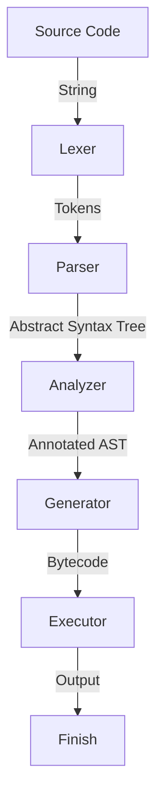

# Custom Programming Language Compiler & Virtual Machine

A complete, compiler, semantic analyzer, code generator, and stack-based virtual machine (VM) written in TypeScript. This project processes a custom, JavaScript-like programming language, compiles it into a compact 1-byte opcode bytecode format, and executes it via a stack-based runtime environment.

---

## 1. Architectural Pipeline

The compilation and execution process flows through five distinct stages:



1. **Tokenization ([src/lexer/index.ts](file:///home/hrutav-modha/Documents/programming-language/src/lexer/index.ts))**: Converts source text into a series of strongly-typed tokens.
2. **Parsing ([src/parser/index.ts](file:///home/hrutav-modha/Documents/programming-language/src/parser/index.ts))**: Constructs an Abstract Syntax Tree (AST) using recursive descent parsing.
3. **Semantic Analysis ([src/analyzer/index.ts](file:///home/hrutav-modha/Documents/programming-language/src/analyzer/index.ts))**: Performs name resolution, loop-context validation, static type checking/folding, and function arity verification.
4. **Bytecode Generation ([src/generator/index.ts](file:///home/hrutav-modha/Documents/programming-language/src/generator/index.ts))**: Compiles the AST into post-fix bytecode and populates a Constant Pool.
5. **Execution ([src/executor/index.ts](file:///home/hrutav-modha/Documents/programming-language/src/executor/index.ts))**: Executes the bytecode inside a stack-based virtual machine with block-scoped symbol tables.

---

## 2. Language Features & Syntax

The source language supports JavaScript-like statements and expressions:

* **Variable & Constant Declarations**: Mutable bindings declared using `let` and immutable bindings declared using `const`.
* **Block Scopes**: Local blocks defined by `{ ... }` that restrict variable visibility.
* **Control Flow**:
  * Conditional branching: `if` and `else` statements.
  * Selection statements: `switch` with `case` clauses and a `default` fallback.
  * Loops: `while`, `do-while`, and `for` loops.
  * Jump statements: `break` and `continue` with lexical verification (cannot be used outside loops).
* **Expressions**:
  * Arithmetic: `+`, `-`, `*`, `/`, `%` (addition also handles string concatenation).
  * Logical: `&` (AND), `|` (OR), `!` (NOT) (Note: single-character `&` and `|` are the language's standard logical operators).
  * Comparison: `==`, `!=`, `<`, `>`, `<=`, `>=`.
  * Grouping: Parenthesized expressions `(expr)`.
* **Functions**: Calling native built-in functions (e.g. `print()`, `add()`).

---

## 3. Installation & Getting Started

### Prerequisites
* [Node.js](https://nodejs.org/) (v16+)
* npm

### Setup
1. Clone the repository and navigate to the project directory:
   ```bash
   cd programming-language
   ```
2. Install the development dependencies:
   ```bash
   npm install
   ```

### Running the Interpreter
To execute the compiler and run the default program in [src/index.ts](file:///home/hrutav-modha/Documents/programming-language/src/index.ts), run:
```bash
npx tsx src/index.ts
```

To run line-of-code statistics:
```bash
./cloc.sh
```

---

## 4. Minimal Working Example

You can import and execute the interpreter directly in TypeScript:

```typescript
import { interprete } from './src/index.ts'

const sourceCode = `
    let x = 10;
    let y = 20;
    let z = add(x, y);
    print(z); // Outputs: 30
    
    if (z > 25) {
        print("Greater than 25");
    } else {
        print("Lesser or equal to 25");
    }
`

interprete(sourceCode)
```

---

## 5. Submodule Specifications

### Lexer
* **Files**: [src/lexer/index.ts](file:///home/hrutav-modha/Documents/programming-language/src/lexer/index.ts), [src/lexer/state.ts](file:///home/hrutav-modha/Documents/programming-language/src/lexer/state.ts), [src/lexer/utils.ts](file:///home/hrutav-modha/Documents/programming-language/src/lexer/utils.ts)
* **Description**: Processes source text character by character. Supports tracking of source code coordinates (row and column) for precise compilation error reports.

### Parser
* **Files**: [src/parser/index.ts](file:///home/hrutav-modha/Documents/programming-language/src/parser/index.ts), [src/parser/state.ts](file:///home/hrutav-modha/Documents/programming-language/src/parser/state.ts)
* **Description**: Converts the token stream into an AST. It enforces operator precedence using precedence levels ranging from assignment to primary expressions.

### Analyzer
* **Files**: [src/analyzer/index.ts](file:///home/hrutav-modha/Documents/programming-language/src/analyzer/index.ts), [src/analyzer/state.ts](file:///home/hrutav-modha/Documents/programming-language/src/analyzer/state.ts)
* **Description**: Enforces semantic rules. It verifies that variables are not declared twice in the same scope, prevents illegal `break` and `continue` placements, type-checks and folds static arithmetic expressions, and checks that function calls match the registered native function arity.

### Generator
* **Files**: [src/generator/index.ts](file:///home/hrutav-modha/Documents/programming-language/src/generator/index.ts), [src/generator/state.ts](file:///home/hrutav-modha/Documents/programming-language/src/generator/state.ts), [src/generator/loop-context.ts](file:///home/hrutav-modha/Documents/programming-language/src/generator/loop-context.ts)
* **Description**: Traverses the AST and emits postfix instruction bytecodes. It records constant values in the [ConstantPool](file:///home/hrutav-modha/Documents/programming-language/src/shared/constant-pool.ts) and emits operand indices. Resolves control flow paths by updating jump placeholders (patching offsets) for loops, conditionals, and switch statements.

### Virtual Machine (Executor)
* **Files**: [src/executor/index.ts](file:///home/hrutav-modha/Documents/programming-language/src/executor/index.ts), [src/executor/state.ts](file:///home/hrutav-modha/Documents/programming-language/src/executor/state.ts)
* **Description**: A bytecode execution engine. It manages a dynamic evaluation stack (`stack`) and a scope stack of symbols (`scopeStack`). For a list of all instruction opcodes, hex values, and descriptions, see [OPCODES.md](file:///home/hrutav-modha/Documents/programming-language/OPCODES.md).

### Shared & Utilities
* **Files**: [src/shared/scope.ts](file:///home/hrutav-modha/Documents/programming-language/src/shared/scope.ts), [src/shared/constant-pool.ts](file:///home/hrutav-modha/Documents/programming-language/src/shared/constant-pool.ts), [src/shared/native-functions.ts](file:///home/hrutav-modha/Documents/programming-language/src/shared/native-functions.ts)
* **Description**: Includes the [ScopeStack](file:///home/hrutav-modha/Documents/programming-language/src/shared/scope.ts#L45) utility used by both the Analyzer and the Executor to manage block scopes, constant pools for pooling deduplicated string/number/boolean constants, and registered native bindings.

---

## 6. Architectural Characteristics & Design Trade-offs

The virtual machine and compiler implement specific architectural choices that introduce design-level constraints:

* **Stack-Based Evaluation VM**: The virtual machine uses a single dynamic evaluation stack for all instructions rather than a register-based architecture. This simplifies bytecode generation but relies heavily on stack manipulation opcodes (`DUP`, `POP`, etc.).
* **Dynamic Scope Resolution**: Variable and constant symbols are resolved at runtime by scanning the active scope stack array sequentially ($O(d)$ complexity, where $d$ is nesting depth), rather than compiling scopes into static lexical offsets.
* **Interpreter Loop Dispatch**: Bytecode execution is driven by a simple sequential switch-case loop over a `Uint8Array`. It does not perform instruction caching, JIT compilation, or register-based bytecode optimizations.

---

## 7. Roadmap & Future Features

The following features do not exist in the current design but are planned for future development:

* **Arrays, Maps, & Objects**: Add support for parsing, type-analyzing, generating bytecode, and executing non-primitive types and nested variable/method lookups.
* **User-Defined Functions (UDFs)**: Implement function declaration syntax (lexer/parser support) and full execution handlers for user-defined function calls (VM executor support).
* **Enhanced Semantic Validation**: Implement full static type checks on conditional expressions (e.g., inside `if` statements) in the analyzer.

